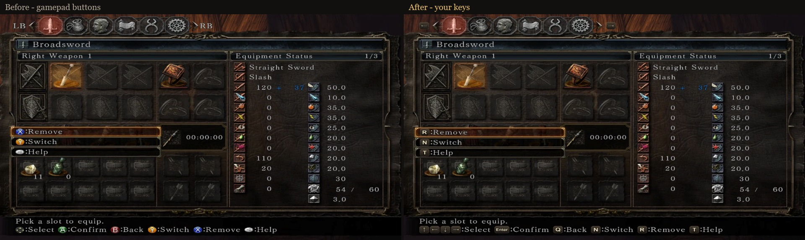

# Dynamic Key Prompts

A mod for FromSoftware's **Dark Souls** games on PC.

Dark Souls II and Dark Souls III always show Xbox buttons in their prompts, even when you play with
keyboard and mouse. Existing mods only swap the button textures for fixed keys, which is wrong as
soon as you rebind anything.

Dynamic Key Prompts reads **your current key bindings** from the game and shows the matching key or
mouse button in every prompt — menus, the help bar, interaction prompts ("Rest at bonfire"),
tutorial messages — and updates immediately when you rebind a key.



## Games

| Game | Status | |
|---|---|---|
| Dark Souls II: Scholar of the First Sin | ✅ 1.0.1 | [Readme](games/ds2/README.md) · [Nexus Mods](https://www.nexusmods.com/darksouls2/mods/1738) |
| Dark Souls III | Planned | |

All releases: [GitHub Releases](https://github.com/HappyEntity/Souls-Dynamic-Key-Prompts/releases) ·
[Changelog](CHANGELOG.md) · [Report a problem](https://github.com/HappyEntity/Souls-Dynamic-Key-Prompts/issues)

## Building from source

Requirements: Visual Studio 2026 (C++ desktop development and .NET desktop development workloads),
.NET 10 SDK.

```powershell
pwsh .\build.ps1            # build every game into .\out\<game>
pwsh .\build.ps1 -Install   # build and copy into the game folder (found through Steam, or -GameDir)
pwsh .\build.ps1 -Install -Loader xinput1_3   # same, with the alternative loader
pwsh .\build.ps1 -Package   # build and create the release zips in .\out
```

`-Game ds2` selects the game for `-Install` (the default). `build.ps1` downloads dearxan on first run.

| Folder | |
|---|---|
| `src/Loader` | `dinput8.dll` / `xinput1_3.dll` — C++ proxy loader (dearxan, MinHook), the same for every game; the `Proxy` property selects the variant |
| `src/Games/<Game>` | `DynamicKeyPrompts.dll` for one game — its hooks, addresses and prompt tables (C#, NativeAOT) |
| `src/Shared` | Code compiled into every game's DLL: loader interface, settings, memory helpers, common build settings (`Core.props`) |
| `src/Common` | Game file formats (DCX, BND4, TPF, FMG, CCM, DDS) and key icon / font generation, shared by the games and the tools |
| `tools/Ds2Tool` | Command-line utility for Dark Souls II's files, used during development (`Ds2Tool` without arguments lists its commands) |
| `games/<game>` | Everything player-facing for one game: readme, screenshots, the readme inside the release zip, the Nexus Mods description |

## Credits

- [dearxan](https://github.com/tremwil/dearxan) by tremwil — Arxan neutering
- [MinHook](https://github.com/TsudaKageyu/minhook) by Tsuda Kageyu — function hooking
- [ds2-mods-rs](https://github.com/Banon-Labs/ds2-mods-rs) — reference for loading next to Seamless Co-op
- The Souls modding community for documenting the games' file formats

## License

[MIT](LICENSE). Third-party components: see [THIRD-PARTY-NOTICES.md](THIRD-PARTY-NOTICES.md).

---

## Кратко по-русски

Мод показывает в подсказках клавиши, которые **вы действительно назначили**, вместо кнопок геймпада,
и сразу обновляет их после переназначения.

- **Dark Souls II: SotFS** — готово (1.0.1), [подробности и установка](games/ds2/README.md).
- **Dark Souls III** — в планах.
