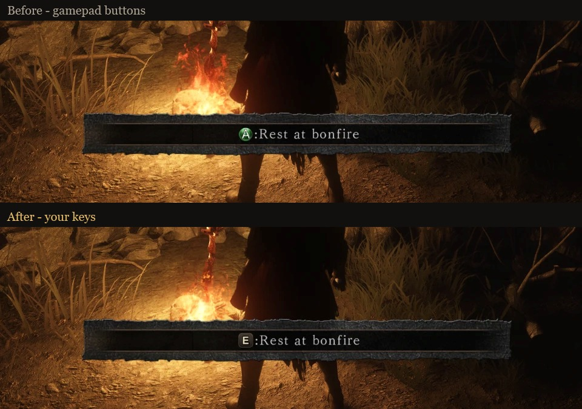
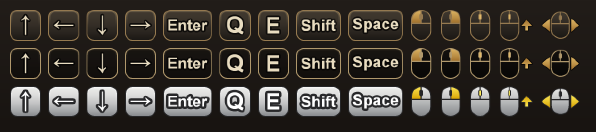

# Dynamic Key Prompts — Dark Souls II: Scholar of the First Sin

[← All games](../../README.md)

Dark Souls II: SotFS always shows Xbox buttons in its prompts, even when you play with keyboard and
mouse. This mod shows the keys and mouse buttons **you bound** instead, and updates them immediately
when you rebind a key.

**Download:** [Nexus Mods](https://www.nexusmods.com/darksouls2/mods/1738) ·
[GitHub Releases](https://github.com/HappyEntity/Souls-Dynamic-Key-Prompts/releases) ·
[Changelog](../../CHANGELOG.md)

Also available for [Dark Souls III](../ds3/README.md).

- Key and mouse icons drawn in the game's style (three built-in themes, fully editable), or plain text labels
- Context aware: in menus A means *Confirm*, in the world it means *Interact* — each resolves to its own key
- Mouse buttons where you use them (attack = LMB, lock-on = MMB), keys elsewhere — configurable
- The game's files are not modified; delete one DLL to uninstall
- Works together with **Seamless Co-op**, **DS2 Lighting Engine** and **OptiScaler**

## Requirements

- Dark Souls II: Scholar of the First Sin, Steam, current version (1.0.3, build 9527516)
- Windows 10/11 x64

## Installation

**Vortex:** use *Mod Manager Download* on the [Nexus Mods page](https://www.nexusmods.com/darksouls2/mods/1738)
and deploy — the files go to the `Game` folder.

**Manually:** download the latest release from [Nexus Mods](https://www.nexusmods.com/darksouls2/mods/1738) or
[GitHub Releases](https://github.com/HappyEntity/Souls-Dynamic-Key-Prompts/releases), then:

1. Open the game folder: Steam → Dark Souls II: SotFS → Manage → Browse local files → `Game`.
2. Copy `dinput8.dll` and the `DynamicKeyPrompts` folder there
   (next to `DarkSoulsII.exe`).
3. Start the game as usual (also through `ds2sc_launcher.exe` for Seamless Co-op).

Uninstall: delete `dinput8.dll` and the `DynamicKeyPrompts` folder.

> The mod loads through `dinput8.dll`. If another mod already uses that file, use the alternative
> loader `xinput1_3.dll` (separate download) instead.
>
> If both names are taken, load the mod with [Ultimate ASI Loader](https://github.com/ThirteenAG/Ultimate-ASI-Loader)
> (or another mod's DLL loader): rename the mod's `dinput8.dll` to `DynamicKeyPrompts.asi` and keep the
> `DynamicKeyPrompts` folder next to it.

## Settings

`DynamicKeyPrompts\DynamicKeyPrompts.ini`:

| Setting | Values | |
|---|---|---|
| `Style` | `icons` / `text` | Key icons or text labels such as `[E]` |
| `IconTheme` | `dark` / `minimal` / `silver` / your own | Look of the icons |
| `Labels` | `auto` / `keyboard` / `mouse` / `both` | Which binding to show when an action has a key and a mouse button |
| `ShortNames`, `Format`, `Color` | | Text style options |
| `[Bindings]` | `<input id>=<text>` | Override the label of a single action |

### Custom icons

Each theme is one sprite sheet in `DynamicKeyPrompts\icons\`: `<theme>.png` with all icons and
`<theme>.txt` with the rectangle of every icon (`Name X Y Width Height`). The built-in sheets are
written there on first start. Edit a sheet, or copy `dark.png`/`dark.txt` to `mytheme.png`/`mytheme.txt`
and set `IconTheme=mytheme`. Icons are scaled to the game's text height, keeping their proportions;
the patched font is rebuilt automatically on the next start.

## Playing online

The mod only changes what you see: the prompt text and a copy of the font. It doesn't touch saves,
params, items or stats and sends nothing over the network.

- **Seamless Co-op:** safe. Seamless uses its own network and doesn't connect to FromSoftware's servers.
- **Official online:** very likely fine for the same reasons, but like most DLL mods it hooks game code
  and disables the game's Arxan anti-tamper, so there is no 100% guarantee. Use at your own risk.

## Troubleshooting

`DynamicKeyPrompts\DynamicKeyPrompts.log` tells what the mod did. Set `Diagnostics=1` for a detailed
log; pressing F9 in game then writes your current bindings to it. Please attach the log when
[reporting a problem](https://github.com/HappyEntity/Souls-Dynamic-Key-Prompts/issues).

## How it works

- `dinput8.dll` (or `xinput1_3.dll`) is a small native loader: it forwards DirectInput / XInput to Windows, neuters the game's
  Arxan anti-tamper with [dearxan](https://github.com/tremwil/dearxan) before the game starts, and
  loads the main module. When the game is started by Seamless Co-op's launcher, dearxan is not used:
  the loader waits until `ds2sc.dll` has loaded and starts the main module when the game's own code
  begins to run. Loaded by another loader (e.g. as an `.asi` plugin), it starts the main module right
  away, also without dearxan.
- `DynamicKeyPrompts.dll` (C#, compiled to native code) hooks the game's text lookup, finds the
  gamepad button characters in each message and replaces them with the key bound to the same action,
  reading the bindings the game itself uses.
- Button icons in DS2 are characters of the game font. For icon mode the mod builds a copy of the
  font with extra key glyphs (in `DynamicKeyPrompts\cache`) and hands that copy to the game when it
  opens its font file.

---

## Кратко по-русски

Мод показывает в подсказках Dark Souls II: SotFS клавиши, которые **вы действительно назначили**,
вместо кнопок геймпада, и сразу обновляет их после переназначения. Установка: скопировать
`dinput8.dll` и папку `DynamicKeyPrompts` в папку `Game` рядом с `DarkSoulsII.exe`. Настройки — в
`DynamicKeyPrompts\DynamicKeyPrompts.ini`, свои значки — в `DynamicKeyPrompts\icons\`. Совместим с
Seamless Co-op, DS2 Lighting Engine и OptiScaler. С Seamless Co-op безопасен для онлайна: он не
подключается к серверам FromSoftware; на официальных серверах 100% гарантии, как у любого DLL-мода, нет.
